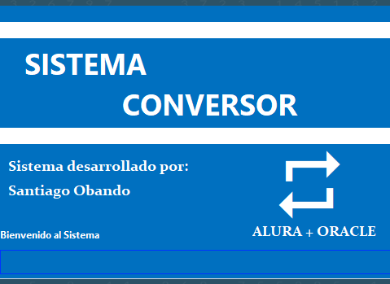

# CONVERSOR MULTIPLE-JAVA

Conversor multiple es una aplicacion que tiene dos conversores: uno para monedas y el otro para temperatura. Con esta aplicacion podremos conocer los distintos valores de la monedas inlcuidas en el codigo, asi mismo podremos saber las distintas medidas en temperatura.

Esta app es una solución al challenge "Convertidor de Moneda" propuesto por Alura Latam Oracle-One Next Education. 

# Características

* Tasa de cambio actual de las diferentes monedas disponibles
* Interfaz gráfica agradable e intuitiva
* Validaciones a los datos ingresados por parte del usuario
* Texto informativos a medida de que el usuario interactua con la aplicacion
# Pasos de instalación
### Ejecutable el archivo conversor.exe
1. Clonar el repositorio
2. Ejecutar la aplicacion Converosr.exe que se encuentra en en la carpeta del proyecto  [ dist/](https://github.com/santieden11/CONVERSOR-DE-MONEDAS-JAVA/blob/f26c4ec824d0c0814276f00cdde639d84d788091/dist) 
3. Disfrute de la aplicación
### Apache NetBeans IDE 16
1. Clonar el repositorio
2. Abir proyecto en Apache NetBeans IDE 16
3. Run main y disfrutar la aplicación

# Proceso
### Tecnologías usadas
* Java 18
* GitHub
* librerias RojeruSan.full_9.6.jar
* RSUtilities.jar

### Validaciones
* Solo son válidos números enteros o decimales
* Para poder convertir se debe seleccionar las monedas correspondientes o la temperatura principal
    
# Autor
Creado por Santiago Eden Obando Bautista
